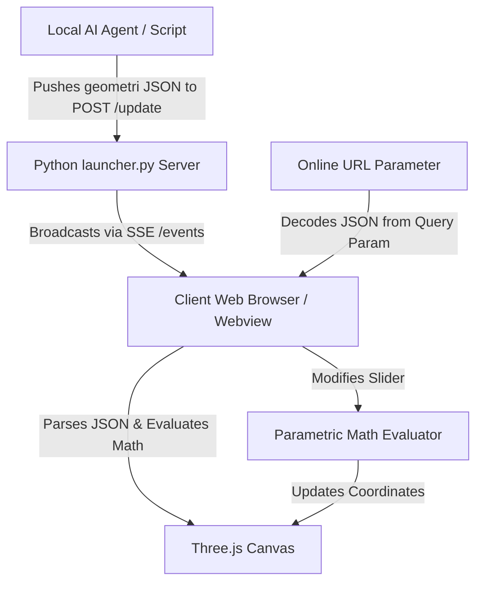

# 🗺️ The GEO Development Journey

Welcome to the open-source history of **GEO**, a client-side 3D Wireframe Representation Engine designed to solve the spatial reasoning bottleneck of artificial intelligence models generating CAD structures. 

This document traces the evolution of the project, details key design decisions, outlines its architecture, and sets a roadmap for contributors and the next developers.

---

## 🚀 The Vision: Why GEO Exists

When AI models design physical objects (brackets, containers, mechanical fixtures), they face a **spatial reasoning bottleneck**:
- Translating natural language directly to stateful, verbose CAD scripts (like Blender `bpy` or FreeCAD python scripts) is complex, error-prone, and lacks visual validation.
- **GEO** solves this by establishing a lightweight, declarative format called **`geometri`**.
- GEO parses and renders `geometri` representations instantly. It can run in a serverless web page or as a native desktop application, letting AI models verify geometry through automated loops before producing heavy production-level code.

---

## 📅 Chronological Project Timeline

All key features were developed in a rapid, modular sequence of iterations:

### Phase 1: Foundation & Core Protocol
* **Milestone**: Creating the `geometri` visualizer skeleton.
* **Key Achievements**:
  * Established the standard JSON schema specification for vertices and wireframe primitives (`line`, `circle`, and `bezier`).
  * Created the main window viewport rendering engine using Three.js with an integrated OrbitControls handler.
  * Implemented an expression evaluator to parse variable parameter formulations (e.g. evaluating formulas like `width * 0.5`).
  * Created [launcher.py](file:///d:/GEO/launcher.py), a python bridge running a hybrid web server and native webview window container (`pywebview`).
* **Core Codebase**:
  * [launcher.py](file:///d:/GEO/launcher.py) - Serves static files and establishes a POST listener for real-time model streaming.
  * [app.js](file:///d:/GEO/app.js) - Contains the parser, math evaluation, and Three.js rendering logic.
  * [index.html](file:///d:/GEO/index.html) - Structured workspace layout with sidebars and code editors.
  * [style.css](file:///d:/GEO/style.css) - Initial grid alignments and canvas containers.
  * [examples.js](file:///d:/GEO/examples.js) - Sample geometric presets demonstrating parametric vertices.
  * [.gitignore](file:///d:/GEO/.gitignore) & [README.md](file:///d:/GEO/README.md) - Standard development repository settings and documentation.

### Phase 2: Serverless Deployment Pipeline
* **Milestone**: Universal sharing.
* **Key Achievements**:
  * Set up a GitHub Actions workflow to automatically publish code changes directly to GitHub Pages on each commit.
* **Core Codebase**:
  * [deploy.yml](file:///d:/GEO/.github/workflows/deploy.yml) - Automatic deployment pipeline configuration.

### Phase 3: Layout, Premium Dark Mode, and Versioning
* **Milestone**: Design polish and iteration control.
* **Key Achievements**:
  * Overhauled the visual appearance with a premium dark-themed layout, HSL color variables, and a glassmorphic blurred overlay system.
  * Integrated **Version Comparison Tabs** to allow side-by-side or quick-switch comparison of multiple model iterations.
  * Added floating viewport camera controllers (orbit/pan, zoom, preset orthogonal resets, and grid/axes togglers) to allow smooth viewing.
* **Core Codebase**:
  * [app.js](file:///d:/GEO/app.js) - Added tab/version states and animated camera movements.
  * [index.html](file:///d:/GEO/index.html) - Structural additions for version listings, grid configurations, and control panels.
  * [style.css](file:///d:/GEO/style.css) - Custom dark theme styling, glassmorphism templates, and interactive transitions.

### Phase 4: Dynamic Parameter Tuning & Shareable Links
* **Milestone**: Interactive optimization and representation sharing.
* **Key Achievements**:
  * Developed real-time parameter tuning: whenever a model has `parameters` declared, GUI inputs are generated so a developer can edit parameters on-the-fly and see recalculations instantly.
  * Implemented high-resolution transparent canvas screenshot capture (.png export).
  * Perfected serverless URL-based sharing: encoding the entire canvas geometry and tab metadata into standard query parameters, allowing developers to share their 3D models with a single link.
* **Core Codebase**:
  * [app.js](file:///d:/GEO/app.js) - Parameter binder bindings, screenshot exporter, and URL state encoder.
  * [index.html](file:///d:/GEO/index.html) & [style.css](file:///d:/GEO/style.css) - Parameter input badges, screenshot button, and layout fixes.

### Phase 5: High-Precision CAD Theme Overhaul
* **Milestone**: Aligning visual design with professional engineering tools.
* **Key Achievements**:
  * Replaced game-console styled bluish hues with a sleek, low-fatigue Obsidian Zinc dark theme and Alabaster studio light theme.
  * Shifted highlights to high-end ice-blue accents, matching professional engineering workspaces like DaVinci Resolve or Figma.
  * Synced Three.js canvas grids, backgrounds, wireframe nodes, and curve selections directly with the shell theme.
* **Core Codebase**:
  * [style.css](file:///d:/GEO/style.css) - Updated to neutral slate/zinc color tokens, fine high-precision borders, and sharp corner radii.
  * [app.js](file:///d:/GEO/app.js) - Synced Three.js canvas grids, backgrounds, and line elements.

### Phase 6: Robust Parsing & Math Sandbox Security
* **Milestone**: Bulletproofing the parser and math expression solver for AI generation.
* **Key Achievements**:
  * Implemented an operator-precedence space-aware tokenizer to support math expressions with spaces without corrupting list coordinate split boundaries.
  * Enforced strict variable naming rules for parameter IDs (starting with a letter/underscore, alphanumeric only) and blocked conflicts with math keywords (`sin`, `cos`, `pi`) to prevent regular expression injection crashes.
  * Patched the math evaluator to intercept invalid values (like division by zero `Infinity` or complex roots `NaN`) and default them to `0` to prevent WebGL viewport crashes.
  * Added degenerate normal vector safeguards (defaulting `0 0 0` normals to `0 0 1`) and strict `b3`/`b4` Bezier primitives.
* **Core Codebase**:
  * [app.js](file:///d:/GEO/app.js) - Improved `evalExpr`, `parseGeoFormat` tokenizer, degenerate checks, and Bezier routing.
  * [GEOMETRI_SPEC.md](file:///d:/GEO/GEOMETRI_SPEC.md) - Documented security and syntax rules for generating AI agents.

---

## 🛠️ Architecture & Technical Decoupling

Here is how the systems interact:



### 1. Zero Build Dependencies (Vanilla Core)
We intentionally chose to write the visualizer using native, dependency-free vanilla JS/CSS. By using basic ES modules and standard HTML5 elements, GEO starts instantly, runs client-side on any browser, and loads in less than 100ms.

### 2. Live Synchronization via SSE (Server-Sent Events)
In native desktop mode, [launcher.py](file:///d:/GEO/launcher.py) serves the app locally. It runs a custom multi-threaded handler [GEOHTTPRequestHandler](file:///d:/GEO/launcher.py#L20-L101). When a local AI script POSTs a new geometry JSON to `/update`, the server streams it over the `/events` endpoint using SSE. The client listener [initSSE](file:///d:/GEO/app.js#L780-L808) captures the data and calls [addTab](file:///d:/GEO/app.js#L426-L467) to display the new design in a new tab without window reload.

### 3. Expression Parsing & Parametric Solving
In [app.js](file:///d:/GEO/app.js), the [evalExpr](file:///d:/GEO/app.js#L283-L294) function handles math evaluation:
```javascript
function evalExpr(expr, params = {}) {
    if (typeof expr === 'number') return expr;
    if (typeof expr !== 'string') return 0;

    let s = expr.replace(/\s+/g, '');
    const keys = Object.keys(params).sort((a, b) => b.length - a.length);
    for (const k of keys) s = s.replace(new RegExp(k, 'g'), `(${params[k]})`);

    if (!/^[0-9+\-*/().]+$/.test(s)) { console.warn('GEO: unsafe expr', expr); return 0; }
    try { return Function(`"use strict"; return (${s})`)(); }
    catch { return 0; }
}
```
Whenever variables are updated via [renderParams](file:///d:/GEO/app.js#L558-L592), coordinates are computed dynamically and re-rendered via [renderModel](file:///d:/GEO/app.js#L299-L412), keeping visual states synced.

---

## 🗺️ Roadmap: Ideas for the Next Developer

As an open-source contributor, here is how you can help take GEO to the next level:

### 1. Solid Extrusion & Mesh Shells
* **Current State**: Visualizes 3D wireframe primitives (`line`, `circle`, and `bezier`).
* **Goal**: Support solid components by defining extrusions or surfaces (e.g. `face` connecting a boundary of coordinates) to render shaded solids in Three.js instead of wireframes alone.

### 2. Automated CAD Script Export
* **Goal**: Build an "Export CAD Script" button. This takes the verified `geometri` representation and transpiles it into standard python code for Blender (`bpy`) or FreeCAD (`Part`), completing the visual pre-visualization workflow.

### 3. Interactive Handle Gizmos
* **Goal**: Integrate 3D control handles in Three.js so users can drag vertices directly inside the viewport canvas, automatically updating the parameters and JSON.

### 4. Code Autocomplete / Schema Validation
* **Goal**: Integrate a lightweight code autocomplete editor (like Prism/Monaco/CodeJar) with JSON schema warning states to flag validation errors directly in the code pane.

---

## 🤝 How to Join Us

1. Clone the repo and follow instructions in [README.md](file:///d:/GEO/README.md).
2. Write clean, documentable code, preserving the zero-dependency nature of the web app.
3. Ensure compatibility with the native bridge server in [launcher.py](file:///d:/GEO/launcher.py).
4. Share designs with other developers by exporting encoded URLs!

Let's build the future of AI-driven spatial design together! 🚀
